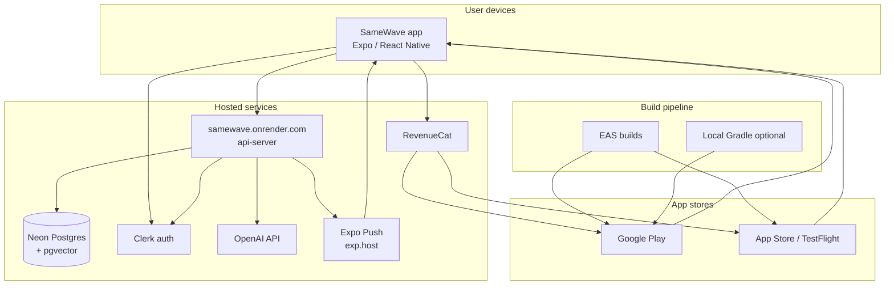

# SameWave — infrastructure & hosting

Where the app runs in production, what each service does, and rough capacity
on **free / hobby** tiers. User counts are approximate; upgrade paths are
noted where the repo calls them out.

**Production API:** `https://samewave.onrender.com`  
**Android package:** `app.echo.samesame`  
**iOS bundle:** `app.echo.samesame`

---

## Architecture

**Auth path in production:** the mobile app talks to Clerk through a proxy on
Render (`/api/__clerk` → `frontend-api.clerk.dev`). See
`artifacts/api-server/src/middlewares/clerkProxyMiddleware.ts`.

---

## Services at a glance

| Service | What it's for | Approx. user / capacity (free–hobby tier) |
|--------|----------------|-------------------------------------------|
| **Expo / React Native** | Client app on device | Unlimited installs |
| **Google Play** | Android distribution | Unlimited public users; closed test needs **12 testers × 14 days** (new personal accounts) |
| **Apple App Store / TestFlight** | iOS distribution | Unlimited at store scale; TestFlight has Apple tester limits |
| **EAS (Expo Application Services)** | Cloud signing & builds | **~30 builds/month** (pipeline, not MAU) |
| **Expo Updates (OTA)** | JS updates without store release | **~1,000 MAU** on free EAS Update — **mostly disabled** in this project (`checkAutomatically: "NEVER"`) |
| **Android Studio + Gradle** | Local AAB builds (optional) | Dev machine only |
| **Clerk** | Sign-in, sessions, user identity | **~50,000 MAU** (Hobby) |
| **Google Cloud / Google Sign-In** | OAuth for Android | Same order of magnitude as Clerk MAU |
| **Render** | Hosts Node `api-server` | **~low hundreds concurrent** on free; **no hard MAU** — **5 GB egress/mo**, sleeps after **~15 min** idle |
| **Neon** | Production Postgres + vectors | **~60,000 MAU** (vendor); **~dozens–low hundreds of heavy photo users** in practice (**0.5 GB** storage) |
| **Docker + Postgres** | Local dev database only | Not production |
| **OpenAI API** | Photo analysis (themes, tags, shapes) | **Budget-limited** (pay per request) |
| **RevenueCat** | IAP entitlements (`pro`) | Free until **~$2,500/mo** tracked revenue, then **1%** |
| **Google Play Billing** | Store purchases (`samewave_pro`) | Unlimited buyers (Google scales) |
| **Apple IAP** (via RevenueCat) | iOS purchases | Unlimited buyers at store scale |
| **Expo Push** (`exp.host`) | Push notifications | **~600 notifications/sec** per project; free to send; server batches **100/call** |

### Not used for production hosting

| Item | Notes |
|------|--------|
| **CDN / object storage** (S3, R2, Cloudflare) | Photos stored as **base64 in Postgres** (MVP); move to blob storage when scaling |
| **Vercel, Supabase, Firebase (runtime), Sentry** | No deploy config in repo |
| **Static web** (`expo export` + `server/serve.js`) | Self-hosted only; no cloud host documented |
| **Unsplash / incompetech.com** | Demo images and royalty-free music URLs only |

---

## Client & distribution

### Expo / React Native (client)

- **Purpose:** SameWave UI — camera, matching, echoes, atlas — on iOS and Android.
- **Config:** `artifacts/same-same/` (`app.json`, `app.config.js`, `eas.json`).
- **Capacity:** No hosting cap; each install runs locally and calls the API.

### Google Play

- **Purpose:** Primary Android distribution (internal → closed → production).
- **Capacity:** Effectively unlimited public installs.
- **Docs:** [play-store-go-live.md](./play-store-go-live.md), `artifacts/same-same/CLOSED_TESTING_CHECKLIST.md`.

### Apple App Store / TestFlight

- **Purpose:** iOS distribution; bundle `app.echo.samesame`.
- **Capacity:** Store-scale; increment `ios.buildNumber` per upload.

### EAS (Expo Application Services)

- **Purpose:** Cloud builds, credentials, submit to stores.
- **Project ID:** `435d5953-8fbe-48a4-9b0c-85096db24c53` (`app.json`).
- **Capacity:** Free tier **~30 cloud builds/month** (resets monthly). Local builds on Windows use Gradle scripts instead of EAS cloud on native Windows.

### Expo Updates (OTA)

- **Purpose:** Over-the-air JS updates (`https://u.expo.dev/...`).
- **This repo:** Updates channel configured but **auto-check disabled** — store releases are the main delivery path.

---

## Authentication

### Clerk

- **Purpose:** Sign-in, sessions; `@clerk/expo` on client, `@clerk/express` on API.
- **Production:** Proxy via `EXPO_PUBLIC_CLERK_PROXY_URL` → `https://samewave.onrender.com/api/__clerk`.
- **Capacity:** **~50,000 MAU** on Clerk Hobby (free).
- **Launch:** Switch from `pk_test_` / `sk_test_` to **`pk_live_` / `sk_live_`** before public launch.

### Google Sign-In (Google Cloud)

- **Purpose:** Android OAuth; Play App Signing SHA-1/256 in Cloud Console.
- **Allowlist:** `app.echo.samesame://callback` in Clerk.

---

## Backend & data

### Render — `samewave.onrender.com`

- **Purpose:** Hosts `artifacts/api-server` — REST API, Clerk proxy, OpenAI analysis, push sender, health checks.
- **Capacity (free web service):** **~750 instance hours/month**, **5 GB** outbound bandwidth, **cold start** after idle sleep. Fine for closed testing; upgrade for always-on production traffic.
- **Setup:** Env vars from `artifacts/api-server/.env.render.example` (no `render.yaml` in repo — manual service config).

### Neon — Postgres

- **Purpose:** Users, photos, echoes, matches, push tokens; **pgvector** for embeddings (768-d).
- **Connection:** `DATABASE_URL` with `?sslmode=require`.
- **Capacity (free):** **~60,000 MAU** (Neon marketing limit) but **0.5 GB storage** is the practical cap while photos live in the database.

### Docker Compose (local only)

- **Purpose:** `postgres:16-alpine` on port 5432 for local dev (`artifacts/api-server/docker-compose.yml`).
- **Not** used for production API hosting.

---

## AI

### OpenAI API

- **Purpose:** `analyzePhoto` / `POST /api/analyze-photo` — themes, tags, shapes, subjects.
- **Config:** `OPENAI_API_KEY`, optional `OPENAI_BASE_URL` (Azure-compatible).
- **Capacity:** Pay-per-use; monitor quota and cost as uploads grow.

---

## Payments

### RevenueCat

- **Purpose:** Unified IAP — entitlement `pro`, offerings, customer info.
- **Capacity:** Free under **~$2,500/month** tracked revenue; then **1%** of revenue.
- **Keys:** `EXPO_PUBLIC_REVENUECAT_*` (client), `REVENUECAT_SECRET_API_KEY` (scripts).

### Google Play Billing

- **Purpose:** In-app product **`samewave_pro`** (lifetime Pro, **£1.00 GBP** in docs).
- **Capacity:** Store-managed; unlimited purchasers.

### Apple In-App Purchase

- **Purpose:** iOS purchases via RevenueCat.
- **Capacity:** Store-managed.

See [play-store-go-live.md](./play-store-go-live.md) for Play Console + RevenueCat wiring.

---

## Push notifications

### Expo Push Notification service

- **Purpose:** Server sends to `https://exp.host/--/api/v2/push/send`; client registers tokens via `expo-notifications`.
- **Implementation:** `artifacts/api-server/src/lib/push.ts` (up to **100 messages per request**).
- **Capacity:** **~600 notifications/second** per project; no per-user fee.
- **Note:** No direct FCM/APNs integration in server code — Expo abstracts delivery.

---

## Key environment variables

| Area | Variables | Where documented |
|------|-----------|------------------|
| Client → API | `EXPO_PUBLIC_API_URL`, `EXPO_PUBLIC_DOMAIN`, `EXPO_PUBLIC_DEV_API_URL` | `artifacts/same-same/.env.example` |
| Clerk (client) | `EXPO_PUBLIC_CLERK_PUBLISHABLE_KEY`, `EXPO_PUBLIC_CLERK_PROXY_URL` | `.env.example`, `eas.json` |
| RevenueCat | `EXPO_PUBLIC_REVENUECAT_*` | `.env.example` |
| API (Render) | `DATABASE_URL`, `CLERK_*`, `OPENAI_*`, `PORT` | `artifacts/api-server/.env.example`, `.env.render.example` |

Production builds in `eas.json` point at `https://samewave.onrender.com` and the Clerk proxy on the same host.

---

## Operational limits (from code & docs)

| Limit | Value | Source |
|-------|--------|--------|
| HTTP JSON body | **12 MB** | `api-server` Express config |
| Photo upload (binary) | **~8 MB** | `api-server` routes |
| API client timeout | **30 s** | `artifacts/same-same/utils/api.ts` |
| Clerk UI boot timeout | **8 s** | `app/_layout.tsx` |
| Expo Push batch | **100** per API call | `api-server/src/lib/push.ts` |
| Render cold start | After **~15 min** idle (free) | Preflight / ops notes |

---

## Practical bottleneck

On the **current architecture** (photos as base64 in Postgres, API on Render free):

1. **Neon storage (0.5 GB)** — limits total photo volume before MAU limits on Clerk or Play matter.
2. **Render sleep + single instance** — cold starts and concurrency during spikes.
3. **OpenAI cost** — scales with every analyzed upload.

**Scaling path (when needed):** paid Neon + always-on Render (or another host), object storage for images, and optional CDN for media.

---

## Related docs

- [play-store-go-live.md](./play-store-go-live.md) — Play Billing, RevenueCat, testers
- `artifacts/same-same/ANDROID_STUDIO_AND_CLOSED_TESTING.md` — local Android builds
- `artifacts/same-same/CLOSED_TESTING_CHECKLIST.md` — pre-launch checklist
- `artifacts/api-server/.env.example` — full API env reference
